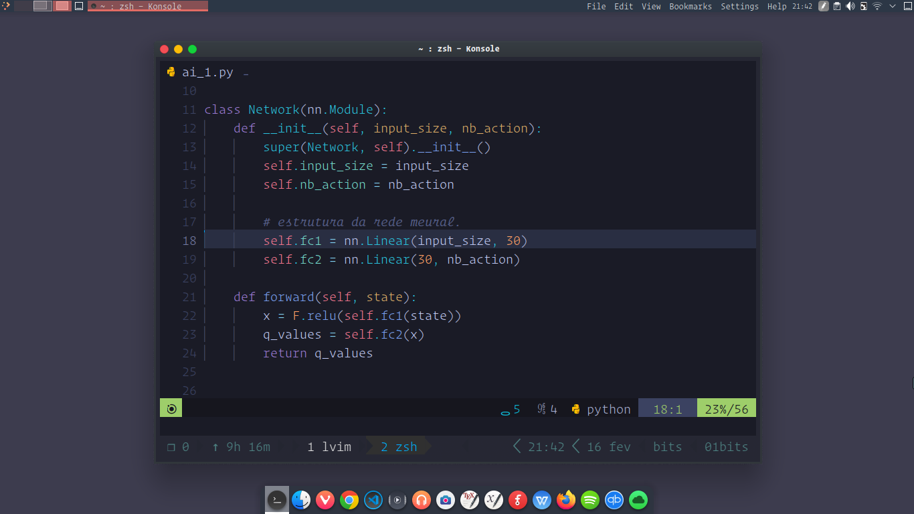
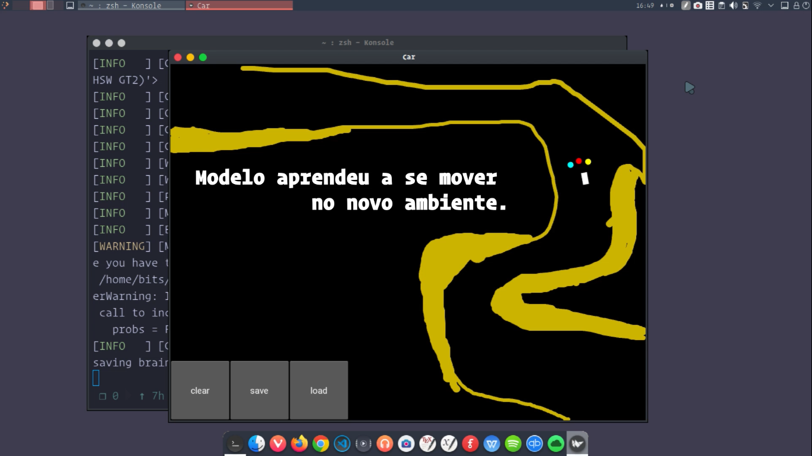

# Deep Q-Learning com Pytorch

## Descrição
O Objetivo desse projeto é fazer com que um Agente aprenda a se mover por um ambiente, para isso será usado sensores para obter informações do ambiente e usa-las como entradas para o Algorítimo de Deep Q-Learning.

## O que é Deep Q-Learning?
Aprendizado profundo por Q-Learning (Deep Q-Learning) é uma técnica de aprendizado de máquina que combina redes neurais artificiais com aprendizado por reforço para ensinar uma inteligência artificial a alcançar sucesso em um determinado ambiente. Essa técnica envolve o recebimento de dados de sensores que mapeiam o ambiente e os usa como entrada para o modelo.

## Objetivo de Projeto

Para esse projeto em questão, o agente que se move pelo ambiente tem sensores que verificam se tem obstáculos no tragedo, essas informações são enviadas para a rede neural artificial que retorna uma ação para o agente efetuar, que o caso é mudar o ângulo em que ele está se movendo, o objetivo é fazer o agente aprender a se mover pelo ambiente sem colidir com os obstáculos.
O obstáculo pode ser entendido como um caminho, em que em suas bordas tem aréia, caso o agente toque na aréia, ele é punido, essa informação de punição também é usada como entrada para a rede neural.

